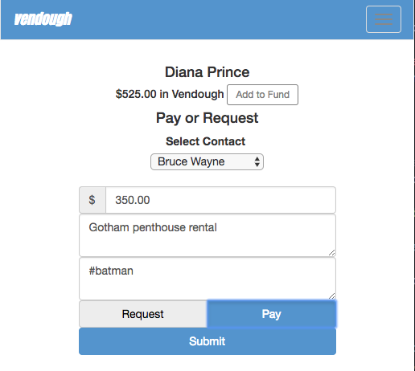

# Vendough

Vendough is a faithful adaptation of a popular money transaction app where users exchange fictional monetary values with each other.

Check out the working demo [here](https://vendough.herokuapp.com//).

Vendough is built using Rails and jQuery.  

<p align="center">
  
  
  
</p>


## Installation

### Things you will need:

- [Rails](http://rubyonrails.org/)
- [Postgres](https://www.postgresql.org/)

### Postgres

You must have [Postgres](https://www.postgresql.org/) installed in your local environment. Open up a Postgres terminal then enter:

```
CREATE role vendough_app WITH createdb
\quit
```

### Rails Local Environment Setup

Clone into local repository.

Type:

```
rails db:create
```

and

```
rake db:migrate
```
also run

```
bundle install
```

to load up gems.

Finally, run in terminal:

```
rails s
```

Go to a local host, and start Vendoughing away.

## Contributing

Bug reports and pull requests are welcome on GitHub at https://github.com/kevinYCKim33/vendough-app. This project is intended to be a safe, welcoming space for collaboration, and contributors are expected to adhere to the [Contributor Covenant](http://contributor-covenant.org) code of conduct.

## License

The app is available as open source under the terms of the [MIT License](http://opensource.org/licenses/MIT).

## Code of Conduct

Everyone interacting in the Vendough project’s codebases, issue trackers, chat rooms and mailing lists is expected to follow the [code of conduct](https://github.com/kevinYCKim33/vendough-app/blob/master/CODE_OF_CONDUCT.md).
